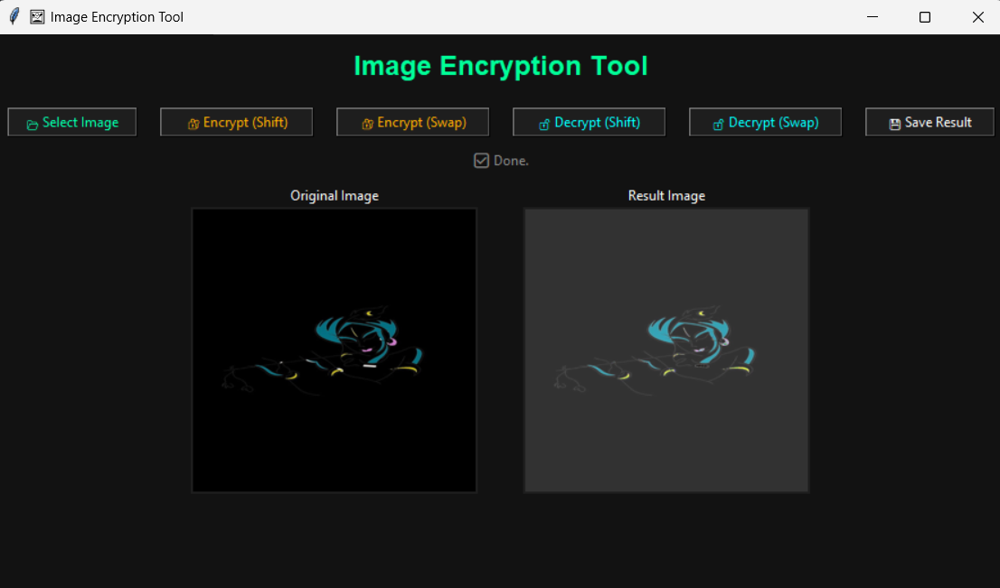

# 🖼️ Image Encryption Tool

A Python-based GUI tool to encrypt and decrypt images using basic pixel manipulation techniques like **shift** and **swap**. Built with `Tkinter` and `Pillow`, it provides a clean, modern interface suitable for learning and basic security demonstration.

---

## 🚀 Features

- 🔐 **Encrypt (Shift):** Shift all pixel values by a fixed value (modulo 256).
- 🔐 **Encrypt (Swap):** Shuffle all pixels randomly based on a seed.
- 🔓 **Decrypt (Shift):** Reverse the shift-based encryption.
- 🔓 **Decrypt (Swap):** Reverse the swap-based encryption.
- 📂 Load images in JPG, JPEG, PNG format.
- 💾 Save the processed image after encryption or decryption.
- 🧠 Built-in threading to keep GUI responsive.
- 🎨 Dark-themed professional hacker-style UI.

---

## 📸 How It Works

### 🔐 Shift Encryption
Each pixel channel value is increased by a shift value, wrapping around 0–255 (e.g., `(value + 50) % 256`).

### 🔀 Swap Encryption
All pixel values are flattened and shuffled using a fixed random seed, which ensures reproducible decryption.

---

## 🖥️ GUI Preview

```
┌─────────────────────────────┐
│      Image Encryption Tool  │
├─────────────────────────────┤
│ 📂 Load   🔐 Encrypt 🔓 Decrypt 💾 Save │
├─────────────────────────────┤
│ Original Image   |  Result Image      │
└─────────────────────────────┘
```

> Clean, symmetric layout designed for clarity and usability.

---

## 🧾 Requirements

- Python 3.x
- `Pillow` library

Install dependencies using pip:

```bash
pip install pillow
```

---

## 📂 Project Structure

```
ImageEncryptionTool/
├── gui.py                # Main GUI logic
├── encryptor.py          # All encryption/decryption logic
├── assets/               # Optional: store sample images
├── README.md             # This file
```

---

## ⚙️ How to Run

```bash
python gui.py
```

You’ll be prompted with a GUI to load, encrypt, decrypt, and save images.

---

## 🧪 Example Use Case

1. Load an image (JPG/PNG).
2. Click **Encrypt (Shift)** or **Encrypt (Swap)**.
3. See encrypted output instantly.
4. Save it using the **💾 Save** button.
5. Later, reload the saved image and decrypt it using the correct method.

---

## 📌 Notes

- Shift uses a default of `+50`, you can customize it in code.
- Swap uses `random.seed(42)`, which ensures consistent results.
- Tool works on RGB images; others will be converted.

---

## 📸 Screenshots




## 📚 Credits

Made with ❤️ by **Aman Patel**

---

## 📥 License

Free for educational and personal use.
